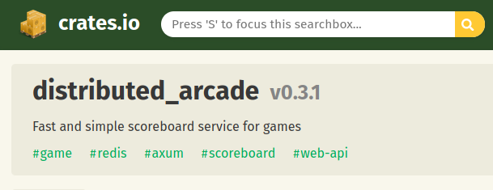
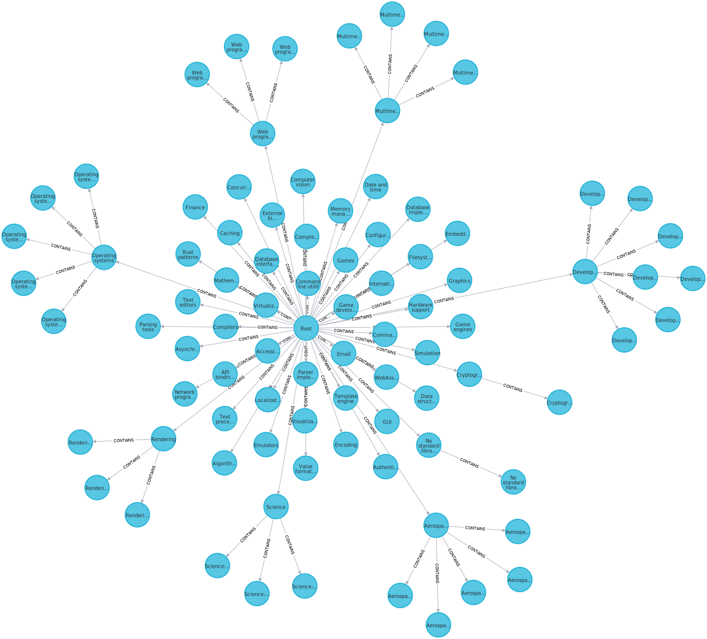
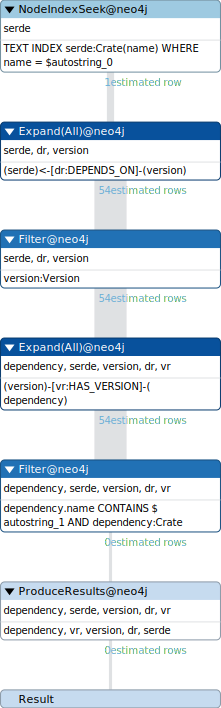
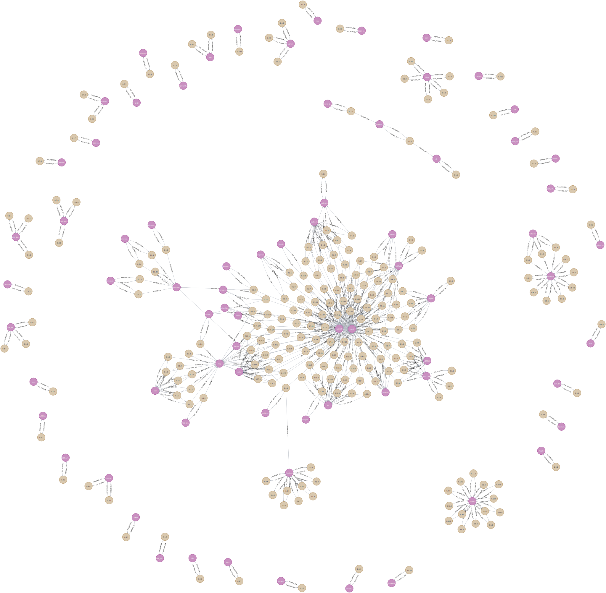

[ Stefano Pigozzi | Use case "creato da zero" | Tema Neo4J | Big Data Analytics | A.A. 2022/2023 | Unimore ]

# Modellazione di un database Neo4J per le dipendenze delle crates del linguaggio Rust

> ### Neo4j
> 
> Studiare e provare un esempio di applicazione reale di Neo4j, scegliendone uno:
>
> * tra le seguenti sandbox disponibili alla pagina https://neo4j.com/sandbox/:
>     * `WWC2019`
>     * `OpenStreetMaps`
> * tra gli esempi illustrati nelle guide https://neo4j.com/developer/example-data/#guide-examples:
>     * `UKCompanies`
>     * `Recipes`
> * tra quelli disponibili alla pagina https://neo4j.com/graphgists/
>
> Quindi, partendo dallo use case scelto, descrivere lo scenario, i dati ed eventualmente le tecniche non viste a lezione esposte nello use case.
> 
> Crearne e descriverne poi una propria versione “estesa” lavorando a uno o più dei seguenti aspetti:
> 
> * modificare/migliorare il grafo, ad es. sostituendo i dati o aggiungendone di nuovi (es. importandoli / adattandoli da altre sorgenti esterne), modificando/arricchendo lo schema (es. aggiungendo nuovi archi o tipi di archi, property, ecc. a supporto di particolari interrogazioni);
> * creare nuove interrogazioni e/o operazioni di modifica di varia complessità nell’ambito dello scenario ispirandosi agli argomenti visti a lezione e agli esercizi proposti nello usecase (opzionalmente: lavorando con codice Python);
> * studiare e creare i migliori indici per alcune delle operazioni previste;
> * ...
> 
> È anche possibile proporre un proprio use case creato da zero.

## Sinossi

Si è realizzato un database a grafo Neo4J che rappresenta l'indice pubblico [Crates.io] delle crates (librerie) del linguaggio di programmazione [Rust], le loro categorie, i loro tag, i loro autori, le loro versioni e le loro dipendenze.

## Introduzione

[Rust] è un linguaggio di programmazione compilato che negli ultimi anni sta acquisendo popolarità grazie alle funzionalità innovative di cui è dotato, che facilitano la scrittura di codice corretto e parallelizzabile.

I progetti in Rust sono organizzati in [crate], unità indivisibili di compilazione, in modo simile ai package di altri linguaggi di programmazione.

Quando pronte per l'utilizzo, le crates vengono generalmente caricate su [Crates.io], repository ufficiale per librerie e eseguibili del linguaggio, che le indicizza e ne permette il download.

Nel workflow standard, le crate sono gestite da [Cargo], strumento a linea di comando in grado di recuperare le crates necessarie alla compilazione del progetto corrente e di organizzarne i metadati, contenuti all'interno del file `Cargo.toml` della directory del progetto, di cui si fornisce il seguente esempio:

```toml
[package]
name = "distributed_arcade"
version = "0.3.0"
authors = ["Stefano Pigozzi <me@steffo.eu>"]
edition = "2021"
description = "Fast and simple scoreboard service for games"
repository = "https://github.com/Steffo99/distributed-arcade"
license = "AGPL-3.0-or-later"
keywords = ["game", "scoreboard", "redis", "axum", "web-api"]
categories = ["games"]

[dependencies]
redis = { version = "0.22.1", features=["r2d2", "ahash", "cluster", "tokio-comp", "connection-manager"] }
axum = { version = "0.5.17" }
tokio = { version = "1.21.2", features=["full"] }
r2d2 = { version = "0.8.10" }
lazy_static = { version = "1.4.0" }
serde = { version = "1.0.147", features=["derive"] }
serde_json = { version = "1.0.87" }
log = { version = "0.4.17" }
pretty_env_logger = { version = "0.4.0" }
rand = { version = "0.8.5" }
regex = { version = "1.7.0" }
async-trait = { version = "0.1.58" }
tower-http = { version = "0.3.4", features=["cors"] }
```

Come si può vedere dall'esempio, tra i metadati di una crate gestita da Cargo, possiamo trovare:

- `name`: il nome della crate
- `version`: la [versione semantica] attuale della crate
- `authors`: nome e email degli autori della crate
- `description`: una breve descrizione in linguaggio naturale dei contenuti della crate
- `repository`: un link al repository Git contenente il sorgente della crate
- `license`: l'[identificatore SPDX] della licenza utilizzata
- `keywords`: fino a 5 termini liberamente scelti dagli autori per rendere più facile trovare la crate nell'indice
- `categories`: fino a 5 categorie dall'[elenco delle categorie previste]
- `dependencies`: nomi, range di versioni e funzionalità delle crate richieste dalla corrente per la compilazione

Quando una nuova versione di una crate viene caricata su Crates.io, i metadati relativi alla crate come `description` e `repository` vengono sovrascritti con quelli più recenti, mentre i metadati specifici alla versione come `dependencies` vengono salvati assieme nella versione specifica.

Lo scopo di questo progetto è di indicizzare questi metadati in un database Neo4J per poi effettuarvi alcune analisi, sfruttando gli [open data] resi disponibili da Crates.io come sorgenti di dati.

## Struttura del progetto

Il progetto è organizzato nelle seguenti directory:

- `README.md`: questo stesso file
- `data/cratesio/`: dove vanno inseriti gli open data pubblicati da Crates.io
- `data/neo4j/`: home del DBMS Neo4J da utilizzare
- `scripts/`: contiene script Bash per l'esecuzione rapida di alcune operazioni sul database Neo4J
- `scripts/import-cratesio/`: contiene query Cypher che vengono eseguite per l'importazione dei file di Crates.io

## Prerequisiti

### Scelta del database

È possibile scegliere di utilizzare un DBMS Neo4J generico, oppure di utilizzarne uno gestito da Neo4J Desktop.

Questo progetto si aspetta che la `NEO4J_HOME` del DBMS scelto si trovi nella cartella `data/neo4j/`.

#### Neo4J Desktop

Utilizzare Neo4J Desktop permette fra le varie cose di utilizzare *Neo4J Bloom*, applicazione che permette di esplorare il database grafo interattivamente, ed è quindi l'opzione consigliata.

Per utilizzare un database Neo4J Desktop, è possibile seguire seguiti i seguenti passi:

1.  Si inizializzi il DBMS su Neo4J Desktop.

2.  Si determini dove la home del DBMS inizializzato è collocata selezionandolo, cliccando l'opzione Altro `···`, e selezionando *Open Folder* → *DBMS*.

3.  Si crei un collegamento simbolico tra la home del DBMS e la posizione `data/neo4j/`:
    ```console
    $ ./scripts/create-neo4j-desktop-link "/home/$USER/.config/Neo4j Desktop/Application/relate-data/dbmss/dbms-$neo4j_uuid/"
    ```
    ```bash
    #!/usr/bin/env bash
    repo=$(git rev-parse --show-toplevel)
    unlink "$repo/data/neo4j"
    ln -s "$1" "$repo/data/neo4j"
    ```

#### Database generico

Per utilizzare un database generico, è possibile seguire i seguenti passi:

1.  Si inizializzi il DBMS e lo si esegua:
    ```console
    $ ./scripts/run-db.sh
    ```
    ```bash
    #!/usr/bin/env bash
    repo=$(git rev-parse --show-toplevel)
    export NEO4J_HOME="$repo/data/neo4j"
    neo4j console
    ```

2.  Mentre il DBMS è in esecuzione, se ne cambi la password predefinita per ottenere accesso a tutte le funzionalità:
    ```console
    $ ./scripts/alter-default-password.sh
    ```

### APOC

Gli open data di Crates.io formattano le date con stringhe in formato `"2023-02-10 07:50:14.995689"` che la funzione [`datetime`] non è in grado di leggere.

Pertanto, per processarle correttamente, si è scelto di includere la libreria [APOC] per Neo4J, che include la funzione [`apoc.date.parse`] con supporto a formati arbitrari per le date.

Essa può essere abilitata su Neo4J Desktop dalla scheda *Plugins* del database, oppure attraverso lo script `scripts/setup-apoc.sh`.

### Heap size incrementata

Alcune query utilizzate in questo progetto superano il massimo di memoria utilizzabile per l'heap da Neo4J, impostato di default a 2 GB.

Per aumentarlo a 6 GB, è necessario aprire il file `data/neo4j/conf/neo4j.conf` e modificare nel seguente modo le proprietà:

```properties
server.memory.heap.initial_size=6g
server.memory.heap.max_size=6g
```

## Realizzazione

### Download dei dati

Si è scaricato il [dump giornaliero del database] di Crates.io del giorno 19 Febbraio 2023, e lo si è estratto nella directory `data/cratesio/2023-02-19-020031/`.

Esso contiene tutti i dati disponibili sotto forma di file comma-separated-values all'interno della directory `data/cratesio/2023-02-19-020031/data/`.

### Ripulitura dei dati

I file `csv` scaricati non sono immediatamente utilizzabili in Neo4J: 

* non effettuano correttamente escaping dei backslash presenti all'interno delle stringhe
* devono trovarsi nella directory `data/neo4j/import`

Entrambi i problemi vengono risolti dal seguente script, che corregge l'escaping e piazza la copia corretta in `data/neo4j/import`:

```console
$ ./scripts/fixup-data-files.sh
```

```bash
#!/usr/bin/env bash

repo=$(git rev-parse --show-toplevel)
cwd=$(pwd)
data_files=$(ls $repo/data/cratesio/*/data/*.csv)

cd "$repo"

for file in $data_files; do
    echo "Fixing data file $file..."
    basefilename=$(basename $file)
    sed --expression='s=\\=\\\\=g' $file > "$repo/data/neo4j/import/$basefilename"
done

cd "$cwd"
```

### Importazione dei dati

I file `csv` ripuliti vengono poi importati nel database Neo4J attraverso una serie di istruzioni Cypher collocate in `./scripts/import-cratesio`, divise in gruppi per tipo di entità importate.

Possono essere eseguite in gruppo o una alla volta con lo script `scripts/import-cratesio.sh`:

*   una alla volta:

    ```console
    $ ./scripts/import-cratesio.sh $NUMERO-
    ```

*   tutte insieme, in ordine:

    ```console
    $ ./scripts/import-cratesio.sh
    ```

Lo script esegue le seguenti istruzioni:

```bash
#!/usr/bin/env bash
set -e

export NEO4J_USERNAME="neo4j"
export NEO4J_PASSWORD="unimore-big-data-analytics-4"

repo=$(git rev-parse --show-toplevel)
cwd=$(pwd)
import_scripts=$(echo $repo/scripts/import-cratesio/$1*.cypher | sort)

cd "$repo"

for file in $import_scripts; do
    echo "Executing $file..."
    cypher-shell --fail-at-end --format verbose < $file
done

cd "$cwd"
```

#### `1` - Creazione dei nodi `:Crate`

Si creano nel grafo nodi aventi il label `:Crate`, importando i dati delle singole crate contenuti all'interno del file `crates.csv`.

##### Proprietà

I nodi `:Crate` avranno le seguenti proprietà:

- `id`: l'id univoco della crate su Crates.io
- `name`: nome univoco con il quale la crate è stata uploadata su Crates.io
- `created_at`: data del primo upload su Crates.io ("data di creazione")
- `updated_at`: data dell'ultimo upload su Crates.io ("data di aggiornamento")
- `max_upload_size`: dimensione della crate massima uploadabile
- `downloads`: numero di download totale

Le seguenti proprietà saranno ugualmente definite, ma potrebbero acquisire un valore di `null` qualora non fossero specificate nei metadati delle crate:

- `description`: breve descrizione della crate
- `readme`: lunga descrizione multilinea della crate
- `documentation`: link alla documentazione della crate
- `homepage`: link alla homepage della crate
- `repository`: link al repository del codice sorgente della crate

##### Indici

Per determinare gli indici da creare, si immaginano alcune semplici interrogazioni che potrebbero essere effettuate sull'insieme dei nodi `:Crate`, e si creano indici in grado di risolverle:

- _ricerca **per id** o **in un intervallo**_: si crea un indice `RANGE` sul campo `id`.

    ```cypher
    CREATE RANGE INDEX index_crate_id IF NOT EXISTS
    FOR (crate:Crate)
    ON (crate.id);
    ```

- _ricerca di crate **con un numero minimo di download**_: si crea un indice `RANGE` sul campo `downloads`.

    ```cypher
    CREATE RANGE INDEX index_crate_downloads IF NOT EXISTS
    FOR (crate:Crate)
    ON (crate.downloads);
    ```

- _ricerca di crate **create** o **aggiornate** **prima** o **dopo una certa data**_: si creano due indici `RANGE`, uno sul campo `created_at`, l'altro sul campo `updated_at`.

    ```cypher
    CREATE RANGE INDEX index_crate_created_at IF NOT EXISTS
    FOR (crate:Crate)
    ON (crate.created_at);

    CREATE RANGE INDEX index_crate_updated_at IF NOT EXISTS
    FOR (crate:Crate)
    ON (crate.updated_at);
    ```
- _ricerca di crate con un **nome**, **prefisso** o **suffisso specifico**_: si crea un indice `TEXT` sul campo `name`.

    ```cypher
    CREATE TEXT INDEX index_crate_name IF NOT EXISTS
    FOR (crate:Crate)
    ON (crate.name);
    ```

##### Query

Si scrive una query per l'importazione di dati da file CSV.

Si utilizza l'istruzione `LOAD CSV WITH HEADERS`, che legge il file CSV dato dalla cartella `$NEO4J_HOME/import` e trasforma ogni riga in un oggetto avente come chiavi i titoli delle colonne definite nella prima riga.

```cypher
LOAD CSV WITH HEADERS FROM "file:///crates.csv" AS line FIELDTERMINATOR ","
```

Essendo il file molto lungo, Neo4J accumula tutti i nodi da creare in una singola transazione, richiedendo al sistema operativo di dedicargli sempre più memoria RAM.

Per evitare che la memoria si esaurisca e che Neo4J venga terminato, si utilizza l'istruzione `CALL {} IN TRANSACTIONS OF N ROWS`, che applica la transazione ogni N righe del file CSV processate.

```cypher
CALL {
    ...
} IN TRANSACTIONS OF 10000 ROWS
```

Infine, si inserisce come argomento di `CALL` la seguente query, che può funzionare sia per inizializzare il database, sia per aggiornarlo con gli ultimi dati:

1. Prova a vedere se esiste già un nodo `:Crate` con il dato `id`.
2. Se non esiste, lo crea.
3. Al nodo, esistente o non, vengono impostate le restanti proprietà, lette dal CSV e convertite nel tipo di Neo4J che le rappresenta più accuratamente.

```
WITH line
MERGE (crate:Crate { id: toInteger(line.id) })
SET 
    crate.created_at = apoc.date.parse(line.created_at, "ms", "yyyy-MM-dd HH:mm:ss"),
    crate.updated_at = apoc.date.parse(line.updated_at, "ms", "yyyy-MM-dd HH:mm:ss"),
    crate.max_upload_size = toInteger(line.max_upload_size),
    crate.downloads = toInteger(line.downloads),
    crate.description = CASE trim(line.description) 
        WHEN "" 
            THEN null 
        ELSE 
            line.description 
        END,
    crate.documentation = CASE trim(line.documentation) 
        WHEN "" 
            THEN null 
        ELSE 
            line.documentation 
        END,
    crate.homepage = CASE trim(line.homepage) 
        WHEN "" 
            THEN null 
        ELSE 
            line.homepage 
        END,
    crate.name = CASE trim(line.name) 
        WHEN "" 
            THEN null 
        ELSE 
            line.name 
        END,
    crate.readme = CASE trim(line.readme) 
        WHEN "" 
            THEN null 
        ELSE 
            line.readme 
        END,
    crate.repository = CASE trim(line.repository) 
        WHEN "" 
            THEN null 
        ELSE 
            line.repository 
        END
```

#### `2` - Creazione dei nodi `:Keyword`

Come menzionato in precedenza, ciascuna crate può specificare fino a 5 keyword al fine di essere trovata più facilmente nell'indice di Crates.io.



Si identificano queste keyword come nodi, a cui si assegna il label `:Keyword`.

Si ripete la stessa procedura di prima per creare un nodo `:Keyword` per ciascuna keyword esistente nel file `keywords.csv`.

##### Proprietà

I nodi `:Keyword` avranno come proprietà:

- `id`: l'id univoco della keyword su Crates.io
- `name`: il nome della keyword
- `creation_date`: la data in cui la keyword è comparsa per la prima volta su Crates.io

##### Indici

Si ripete la stessa procedura di prima per creare alcuni indici relativi ai nodi `:Keyword`.

Query e indici identificati sono:

- _ricerca **per id**_: si crea un indice `RANGE` sul campo `id`.

    ```cypher
    CREATE RANGE INDEX index_keyword_id IF NOT EXISTS
    FOR (keyword:Keyword)
    ON (keyword.id);
    ```

- _ricerca **per nome**_: si crea un indice `TEXT` sul campo `name`.

    ```cypher
    CREATE TEXT INDEX index_keyword_name IF NOT EXISTS
    FOR (keyword:Keyword)
    ON (keyword.name);
    ```

##### Query

Come prima, si crea una query per inizializzazione o aggiornamento, che, per ogni riga del file `keywords.csv`, applica il seguente algoritmo:

1. Prova a vedere se esiste già un nodo `:Keyword` con il dato `id`.
2. Se non esiste, lo crea.
3. Al nodo, esistente o non, vengono impostate le restanti proprietà, lette dal CSV e convertite nel tipo di Neo4J che le rappresenta più accuratamente.

```cypher
LOAD CSV WITH HEADERS FROM "file:///keywords.csv" AS line FIELDTERMINATOR ","
MERGE (keyword:Keyword { id: toInteger(line.id) })
SET 
    keyword.created_at = apoc.date.parse(line.created_at, "ms", "yyyy-MM-dd HH:mm:ss"),
    keyword.name = line.keyword;
```

#### `3` - Creazione delle relazioni `:IS_TAGGED_WITH`

Il file `crates_keywords.csv` associa crate alle loro keyword specificando un'associazione tra id di una crate e id di una keyword in ogni riga.

Si costruisce a partire da esso la relazione `:IS_TAGGED_WITH`, diretta dalla `:Crate` alla `:Keyword`.

##### Query

Quando viene caricata su Crates.io una nuova versione di una crate, le sue keywords possono essere cambiate.

Per permettere alla query di funzionare sia per l'inizializzazione del grafo, sia per il suo aggiornamento, si effettuano due passi:

1. Tutte le relazioni `:IS_TAGGED_WITH` sono rimosse.

    ```cypher
    MATCH (:Crate)-[relation:IS_TAGGED_WITH]->(:Keyword)
    DELETE relation;
    ```

2. Il file `crates_keywords.csv` viene aperto, e per ciascuna riga viene creata una nuova relazione `:IS_TAGGED_WITH`.

    ```
    LOAD CSV WITH HEADERS FROM "file:///crates_keywords.csv" AS line FIELDTERMINATOR ","
    MATCH 
        (crate:Crate {id: toInteger(line.crate_id)}),
        (keyword:Keyword {id: toInteger(line.keyword_id)})
    CREATE (crate)-[:IS_TAGGED_WITH]->(keyword);
    ```

#### `4` - Creazione dei nodi `:Category`

Oltre alle keyword, ciascuna crate può scegliere di appartenere a fino a cinque categorie di un thesaurus gerarchico definito dagli amministratori di Crates.io.

Il file `categories.csv` contiene tutte le categorie esistenti al momento dell'esportazione dei dati da Crates.io.

Si identificano le categorie come nodi aventi il label `:Category`, la cui gerarchia è rappresentata da relazioni `:CONTAINS`.

##### Struttura

I nodi `:Category` avranno le seguenti proprietà, importate dal file CSV:

- `id`: identificatore univoco della categoria;
- `name`: nome breve in inglese della categoria;
- `slug`: nome breve url-encoded della categoria, mostrato nell'indirizzo web;
- `path`: percorso di identificatori separati da punti che determina dove si trova la categoria nella gerarchia;
- `created_at`: data di creazione della categoria.

Per facilitare la navigazione del grafo, si aggiunge inoltre la seguente proprietà:

- `leaf`: l'ultimo identificatore del `path`.

##### Indici

Si ipotizzano le seguenti query e indici per i nodi `:Category`:

- _ricerca **per id**_: si crea un indice `RANGE` sul campo `id`.

    ```cypher
    CREATE RANGE INDEX index_category_id IF NOT EXISTS
    FOR (category:Category)
    ON (category.id);
    ```

- _ricerca **per nome**_: si crea un indice `TEXT` sul campo `name`.

    ```cypher
    CREATE TEXT INDEX index_category_name IF NOT EXISTS
    FOR (category:Category)
    ON (category.name);
    ```

- _ricerca **per slug**_: si crea un indice `TEXT` sul campo `slug`.

    ```cypher
    CREATE TEXT INDEX index_category_slug IF NOT EXISTS
    FOR (category:Category)
    ON (category.slug);
    ```

- _ricerca **per leaf**_: si crea un indice `TEXT` sul campo `leaf`.

    ```cypher
    CREATE TEXT INDEX index_category_leaf IF NOT EXISTS
    FOR (category:Category)
    ON (category.leaf);
    ```

##### Query

Essendo le categorie variabili, proprio come le keywords, per permettere l'aggiornamento del database con nuovi dati, inizialmente si eliminano tutti i nodi `:Category`, per poi ricrearli successivamente.

```cypher
MATCH (category:Category)
DETACH DELETE category;
```

Ci si è accorti che all'interno del file CSV il nodo "root" (origine) della gerarchia è assente, quindi lo si crea prima di procedere con l'importazione vera e propria dei dati:

```cypher
CREATE (
    :Category {
        name: "Root",
        created_at: datetime(),
        description: "Root category. Does not contain any category by itself.",
        id: 0,
        path: "root",
        slug: "root"
    }
);
```

Si usa in seguito `LOAD CSV WITH HEADERS` per creare nodi `:Category` dal file `categories.csv`, lasciando non specificato il campo `leaf`:

```cypher
LOAD CSV WITH HEADERS FROM "file:///categories.csv" AS line
CREATE (
    :Category {
        name: line.category,
        created_at: apoc.date.parse(line.created_at, "ms", "yyyy-MM-dd HH:mm:ss"),
        description: line.description,
        id: toInteger(line.id),
        path: line.path,
        slug: line.slug
    }
);
```

Per ciascun nodo `:Category`, si prende poi il campo `path` e lo si divide in un array di stringhe alle occorrenze del carattere `"."`, utilizzando successivamente la sintassi `[-1]` per accedere all'ultimo elemento, che viene impostato come valore del campo `leaf`:

```cypher
MATCH (c:Category)
WITH c, split(c.path, ".") AS path
SET c.leaf = path[-1];
```

Ancora, si effettua una seconda scansione su tutti i nodi `:Category`, splittando di nuovo il `path`, ma stavolta prendendo il penultimo (`[-2]`) elemento dell'array per determinare il nodo `:Category` superiore nella gerarchia e poi creando una relazione `:CONTAINS` tra i due nodi:

```cypher
MATCH (c:Category)
WITH c, split(c.path, ".") AS path
MATCH (d:Category {leaf: path[-2]})
CREATE (d)-[:CONTAINS]->(c);
```

#### `5` - Creazione delle relazioni `:CONTAINS`

Il file `crates_categories.csv`, esattamente come `crates_keywords.csv`, contiene una coppia di id per riga, uno di una `:Crate` e uno di una `:Category`.

Si effettua quindi lo stesso esatto procedimento per creare  relazioni `:CONTAINS` da `:Category` a `:Crate`.

```cypher
MATCH (:Category)-[relation:CONTAINS]->(:Crate)
DELETE relation;

LOAD CSV WITH HEADERS FROM "file:///crates_categories.csv" AS line FIELDTERMINATOR ","
MATCH 
    (crate:Crate {id: toInteger(line.crate_id)}),
    (category:Category {id: toInteger(line.category_id)})
CREATE (category)-[:CONTAINS]->(crate);
```

#### `6` - Creazione dei nodi `:User`

Crates.io richiede di effettuare il login con account GitHub a tutti coloro che desiderano uploadare una crate.

Al primo login, viene creata un'entità nel database di Crates.io, che riassume i dettagli dell'account GitHub e gli associa un id interno.

Si è deciso di inserire nel grafo gli utenti come nodi aventi il label `:User`.

##### Proprietà

Si definiscono le seguenti proprietà per i nodi `:User`:

- `id`: L'id univoco interno assegnato da Crates.io
- `gh_id`: L'id univoco esterno di GitHub
- `avatar`: L'avatar dell'utente su GitHub
- `name`: L'username dell'utente su GitHub
- `full_name`: Nome e cognome dell'utente su GitHub

##### Indici

Si ipotizzano le seguenti query per nodi `:User` e i relativi indici:

- _ricerca per **id di Crates.io**_: si crea un indice `RANGE` sul campo `id`.

    ```cypher
    CREATE RANGE INDEX index_user_id IF NOT EXISTS
    FOR (user:User)
    ON (user.id);
    ```

- _ricerca per **id di GitHub**_: si crea un indice `RANGE` sul campo `gh_id`.

    ```cypher
    CREATE RANGE INDEX index_user_ghid IF NOT EXISTS
    FOR (user:User)
    ON (user.gh_id);
    ```

- _ricerca per **username di GitHub**_: si crea un indice `TEXT` sul campo `name`.

    ```cypher
    CREATE TEXT INDEX index_user_name IF NOT EXISTS
    FOR (user:User)
    ON (user.name);
    ```

- _ricerca per **nome proprio, cognome, o parti di essi**_: si crea un indice `TEXT` sul campo `full_name`.

    ```cypher
    CREATE TEXT INDEX index_user_fullname IF NOT EXISTS
    FOR (user:User)
    ON (user.full_name);
    ```

##### Query

Si realizza una query che effettua il merge degli utenti importati in base al loro `id`, e poi ne aggiorna i dati:

```cypher
LOAD CSV WITH HEADERS FROM "file:///users.csv" AS line FIELDTERMINATOR ","
MERGE (user:User { id: toInteger(line.id) })
SET 
    user.avatar = line.gh_avatar,
    user.gh_id = toInteger(line.gh_id),
    user.name = line.gh_login,
    user.full_name = line.name;
```

#### `7` - Creazione delle relazioni `:OWNS`

L'utente che carica per la prima volta una crate con un dato nome ne è detto il *proprietario*.

Egli, in qualsiasi momento, può aggiungere altri proprietari dall'interfaccia web di Crates.io.

I proprietari di una crate sono gli unici utenti che possono caricarne nuove versioni.

Si identifica la proprietà come una relazione tra `:Crate` e `:User` etichettata `:OWNS`.

Le relazioni di proprietà, assieme ad alcune informazioni ad esse collegate, sono contenute nel file `crate_owners.csv` del dataset.

##### Proprietà

Si associano le seguenti proprietà alle relazioni `:OWNS`:

- `created_at`: data in cui l'utente è stato aggiunto come proprietario alla crate
- `created_by`: id di Crates.io dell'utente che ha aggiunto l'utente come proprietario
- `owner_kind`: sconosciuto, è presente nel dataset ma per ora è sempre impostato a `1`

##### Query

Essendo le relazioni di proprietà variabili (un proprietario "secondario" potrebbe essere rimosso dal proprietario "originale"), tutte le relazioni `:OWNS` già esistenti vengono prima eliminate e poi ricreate con i dati aggiornati. 

```cypher
MATCH (:User)-[owns:OWNS]->(:Crate)
DELETE owns;

LOAD CSV WITH HEADERS FROM "file:///crate_owners.csv" AS line FIELDTERMINATOR ","
MATCH (crate:Crate { id: toInteger(line.crate_id) })
MATCH (owner:User { id: toInteger(line.owner_id) })
CREATE (owner)-[ownership:OWNS {
    created_at: apoc.date.parse(line.created_at, "ms", "yyyy-MM-dd HH:mm:ss"),
    created_by: toInteger(line.created_by),
    owner_kind: toInteger(line.owner_kind)
}]->(crate);
```

#### `8` - Creazione dei nodi `:Version` e delle relazioni `:HAS_VERSION` e `:PUBLISHED`

Ogni upload di una crate a Crates.io contiene una stringa nel formato `X.Y.Z` detta *versione*, che, assieme al nome della crate, determina una tupla in grado di identificarlo.

Il dataset contiene informazioni sulle versioni nel file `versions.csv`.

Si decide di rappresentare le versioni attraverso nodi etichettati `:Version`, le crate a cui si riferiscono con relazioni `(:Crate)-[:HAS_VERSION]->(:Version)`, e gli utenti che le hanno pubblicate con relazioni `(:User)-[:PUBLISHED]->(:Version)`.

##### Proprietà

Si definiscono le seguenti proprietà per i nodi `:Version`:

- `id`: identificatore numerico incrementale assegnato da Crates.io
- `name`: [nome semantico] della versione, come `v1.2.3`
- `checksum`: hash SHA1 del commit che aggiunge la versione all'indice
- `size`: dimensione in bytes della versione
- `created_at`: data di upload della versione
- `downloads`: numero di download della versione
- `license`: stringa SPDX rappresentante le licenze open source sotto cui la versione è resa disponibile
- `features`: blob JSON contenente metadati sui tag assegnati alle dipendenze opzionali della crate, detti "feature"
- `links`: blob JSON di collegamenti aggiuntivi specificati nei metadati della crate
- `is_yanked`: se il download della versione è stato sconsigliato da un proprietario

Non si definiscono invece proprietà per le relazioni `:HAS_VERSION` e `:PUBLISHED`.

<!-- TODO: Aggiungere un campo per maggiore, minore, e patch? -->

##### Indici

Query ipotetiche e indici creati per nodi `:Version` sono:

- _ricerca **per checksum**_: si crea un indice `LOOKUP` sul campo `checksum`.

    ```cypher
    CREATE LOOKUP INDEX index_version_checksum IF NOT EXISTS
    FOR (version:Version)
    ON (version.checksum);
    ```

- _ricerca di versioni **più grandi o più piccole di un certo numero di bytes**_: si crea un indice `RANGE` sul campo `size`.

    ```cypher
    CREATE RANGE INDEX index_version_size IF NOT EXISTS
    FOR (version:Version)
    ON (version.size);
    ```

- _ricerca di versioni rilasciate **prima, durante, o dopo una certa data**_: si crea un indice `RANGE` sul campo `created_at`. 

    ```cypher
    CREATE RANGE INDEX index_version_created_at IF NOT EXISTS
    FOR (version:Version)
    ON (version.created_at);
    ```

- _ricerca di versioni con **almeno un certo numero di download**_: si crea un indice `RANGE` sul campo `downloads`.

    ```cypher
    CREATE RANGE INDEX index_version_downloads IF NOT EXISTS
    FOR (version:Version)
    ON (version.downloads);
    ```

- _ricerca **per id**_: si crea un indice `RANGE` sul campo `id`.

    ```cypher
    CREATE RANGE INDEX index_version_id IF NOT EXISTS
    FOR (version:Version)
    ON (version.id);
    ```

- _ricerca per **versione** o **range di versioni**_: si crea un indice `TEXT` sul campo `name`, in quanto esso permette la ricerca di prefissi, suffissi, e sottostringhe, che riassumono efficientemente buona parte delle query effettuabili sul campo

    ```cypher
    CREATE TEXT INDEX index_version_name IF NOT EXISTS
    FOR (version:Version)
    ON (version.name);
    ```

##### Query

Essendo le versioni di una crate immutabili, si utilizza lo stesso procedimento utilizzato per i nodi `:Crate` per inizializzazione e aggiornamento del database, ovvero di effettuare un `MERGE` sull'`id` e di impostare sul nodo trovato o creato le varie proprietà aggiornate.

Nella stessa query si individua la crate a cui appartiene la versione, e si crea una relazione `HAS_VERSION` tra i due nodi; allo stesso modo, si individua l'utente che ha pubblicato la versione, e si crea con esso una relazione `:PUBLISHED`.

```cypher
LOAD CSV WITH HEADERS FROM "file:///versions.csv" AS line FIELDTERMINATOR ","
CALL {
    WITH line
    MERGE (version:Version { id: toInteger(line.id) } )
    SET 
        version.checksum = line.checksum,
        version.size = toInteger(line.crate_size),
        version.created_at = apoc.date.parse(line.created_at, "ms", "yyyy-MM-dd HH:mm:ss"),
        version.downloads = toInteger(line.downloads),
        version.license = line.license,
        version.features = line.features,
        version.links = line.links,
        version.name = line.num,
        version.is_yanked = CASE line.yanked
            WHEN "t"
                THEN true
            ELSE
                false
            END
    WITH line, version
    MATCH (crate:Crate { id: toInteger(line.crate_id) })
    MERGE (crate)-[:HAS_VERSION]->(version)
    WITH line, version
    MATCH (user:User { id: toInteger(line.published_by) })
    MERGE (user)-[:PUBLISHED]->(version)
} IN TRANSACTIONS OF 10000 ROWS;
```

#### `9` - Creazione delle relazioni `:DEPENDS_ON`

Ciascuna versione di una crate deve specificare quali altre versioni di crate richiede per una corretta compilazione.

Le versioni necessarie sono specificate come [un range di versioni accettabili di una data crate in forma di stringa](https://doc.rust-lang.org/cargo/reference/specifying-dependencies.html), e sono dette *dipendenze* della versione specificante, contenute nel file `dependencies.csv` del dataset.

Alcuni esempi delle precedenti stringhe sono:

```toml
[dependencies]
rand = "*"  # Qualsiasi versione della crate rand è accettabile
serde = "^1.0.0"  # Qualsiasi versione della crate serde tra 1.0.0 (inclusa) e 2.0.0 (esclusa) è accettabile
quote = "~1.0.0"  # Qualsiasi versione della crate quote tra 1.0.0 (inclusa) e 1.1.0 (esclusa) è accettabile
itoa = "=1.0.0"  # Solo la versione 1.0.0 della crate itoa è accettabile
```

Si decide di rappresentare le dipendenze come relazioni etichettate come `:DEPENDS_ON`.

##### Proprietà

Si stabiliscono le seguenti proprietà per le relazioni di dipendenza:

- `id`: id univoco che identifica la relazione
- `requirement`: stringa determinante il range di versioni accettabili
- `target`: le piattaforme di compilazione (x86, arm, riscv) in cui è richiesta la dipendenza
- `is_optional`: se la dipendenza è facoltativa, ovvero se si può usare la crate senza di essa (ma con funzionalità ridotte)
- `is_default`: se la dipendenza è facoltativa, ma viene installata di default se non viene esclusa esplicitamente
- `features`: blob JSON riguardo le feature di cui la dipendenza fa parte
- `explicit_name`: se presente, il nome a cui deve essere rinominata la dipendenza durante la compilazione della crate

##### Indici

Si ipotizzano le seguenti query e si creano i relativi indici per processarle:

- _ricerca per **id**_: si crea un indice `RANGE` sul campo `id`.

    ```cypher
    CREATE RANGE INDEX index_dependency_id IF NOT EXISTS
    FOR ()-[dependency:DEPENDS_ON]->()
    ON (dependency.id);
    ```

- _ricerca per **versione** o **range di versioni**_: si crea un indice `TEXT` sul campo `requirement`, con lo stesso scopo dell'indice per la ricerca per nome semantico dei nodi `:Version`.

    ```cypher
    CREATE TEXT INDEX index_dependency_requirement IF NOT EXISTS
    FOR ()-[dependency:DEPENDS_ON]->()
    ON (dependency.requirement);
    ```

- _ricerca per **nome esplicito**_: si crea un indice `TEXT` sul campo `explicit_name`.

    ```cypher
    CREATE TEXT INDEX index_dependency_explicit_name IF NOT EXISTS
    FOR ()-[dependency:DEPENDS_ON]->()
    ON (dependency.explicit_name);
    ```

##### Query

```cypher
LOAD CSV WITH HEADERS FROM "file:///dependencies.csv" AS line FIELDTERMINATOR ","
CALL {
    WITH line
    MATCH 
        (version:Version { id: toInteger(line.version_id) }),
        (requirement:Crate { id: toInteger(line.crate_id) })
    MERGE (version)-[dependency:DEPENDS_ON]->(requirement)
    SET
        dependency.id = line.id,
        dependency.is_optional = CASE line.optional
            WHEN "t"
                THEN true
            ELSE
                false
            END,
        dependency.is_default = CASE line.default_features
            WHEN "t"
                THEN true
            ELSE
                false
            END,
        dependency.explicit_name = line.explicit_name,
        dependency.features = line.features,
        dependency.requirement = line.req,
        dependency.target = line.target
} IN TRANSACTIONS OF 10000 ROWS;
```

## Alcune interrogazioni interessanti

Per dimostrare le possibilità offerte dal grafo, si presentano alcune query effettuabili ritenute particolarmente interessanti.

Le risposte incluse si riferiscono al dataset del 19 Febbraio 2023, non allegato a questa relazione per motivi di dimensioni.

### Numero totale di crate

> "Quante crate sono state uploadate a Crates.io, in totale?"

Si propone la seguente query, che conta il numero di nodi `:Crate`, per rispondere alla domanda:

```cypher
MATCH (crate:Crate)
RETURN count(crate);
```

```text
105287
```

### Numero totale di download di tutte le crate su tutte le versioni

> "Quante versioni di crate sono state scaricate su Crates.io?"

Si propone la seguente query, che somma i valori del campo `download` di tutti i nodi `:Version`, per rispondere alla domanda:

```cypher
MATCH (version:Version)
RETURN sum(version.downloads);
```

```text
27475924849
```

### Albero delle categorie

> "Come è organizzata la gerarchia di categorie di Crates.io?"

Si propone la seguente query, che recupera tutti i nodi `:Category` e le loro relazioni `:CONTAINS`, per rispondere alla domanda:

```cypher
MATCH (supercategory:Category)-[conts:CONTAINS*]->(category:Category)
RETURN supercategory, conts, category;
```



### Informazioni relative a una specifica crate

> "Voglio sapere tutto il possibile sulla [crate `rand`]."

Si propone la seguente query, che recupera il singolo nodo `:Crate` avente `"rand"` come `name`, per rispondere alla domanda:

```cypher
MATCH (crate:Crate {name: "rand"})
RETURN crate;
```

In alternativa, si propone la seguente query, che recupera la `:Crate` `rand` e tutti i nodi a cui essa si connette direttamente, e le connessioni:

```cypher
MATCH (crate:Crate {name: "rand"})-[rel]->(other)
RETURN crate, rel, other;
```


### Dipendenze di `serde` il cui nome contiene a loro volta con `serde`

> "Esistono delle crate, che dipendono direttamente dalla [crate `serde`], che hanno a loro volta `serde` nel nome? 
> 
> (Potrebbero essere ad esempio delle estensioni di qualche tipo.)

Si propone la seguente query, che trova tutte le versioni che dipendono da `serde` e poi recupera la crate a cui appartengono, per verificare:

```cypher
MATCH (dependency:Crate)-[vr:HAS_VERSION]->(version:Version)-[dr:DEPENDS_ON]->(serde:Crate {name: "serde"})
WHERE dependency.name CONTAINS "serde"
RETURN dependency, vr, version, dr, serde;
```




### Crate dipendenti da loro stesse

> "Esistono delle crate che dipendono da loro stesse?"

Si propone la seguente query, con funzionamento molto simile alla precedente, per verificare:

```cypher
MATCH (a:Crate)-[rhv:HAS_VERSION]->(v:Version)-[rdo:DEPENDS_ON]->(b:Crate)
WHERE a = b
RETURN a, rhv, v, rdo, b
ORDER BY v.downloads DESC;
```

> (Approfondendo la ricerca, si è scoperto che [è una tecnica usata per migliorare la compatibilità delle crate](https://github.com/dtolnay/semver-trick)!)



### Le crate di un utente e tutti i loro dettagli

> "Quali crate ha rilasciato l'utente Steffo99, e come sono collegate tra loro?

Si propone la seguente query, che recupera tutte le informazioni interessanti riguardo l'utente specificato, per rispondere alla domanda:

```cypher
MATCH (user:User {name: "Steffo99"})-[owns:OWNS]->(crate:Crate)
MATCH (crate:Crate)-[is_tagged_with:IS_TAGGED_WITH]->(keyword:Keyword)
MATCH (crate:Crate)-[has_version:HAS_VERSION]->(version:Version)
MATCH (crate:Crate)<-[contains:CONTAINS]-(category:Category)
MATCH (category:Category)<-[supercontains:CONTAINS]-(supercategory:Category)
RETURN user, owns, crate, is_tagged_with, keyword, has_version, version, contains, category, supercontains, supercategory;
```


<!-- Collegamenti -->

[Crates.io]: https://crates.io
[Rust]: https://www.rust-lang.org
[crate]: https://doc.rust-lang.org/book/ch07-01-packages-and-crates.html
[versione semantica]: https://semver.org
[identificatore SPDX]: https://spdx.org/licenses/
[Cargo]: https://doc.rust-lang.org/cargo/
[elenco delle categorie previste]: https://github.com/rust-lang/crates.io/blob/master/src/boot/categories.toml
[open data]: https://crates.io/data-access
[`apoc.date.parse`]: https://neo4j.com/labs/apoc/4.3/overview/apoc.date/apoc.date.parse/
[`datetime`]: https://neo4j.com/docs/cypher-manual/5/syntax/temporal/
[dump giornaliero del database]: https://static.crates.io/db-dump.tar.gz
[nome semantico]: https://semver.org/
[crate `rand`]: https://crates.io/crates/rand
[crate `serde`]: https://crates.io/crates/serde
